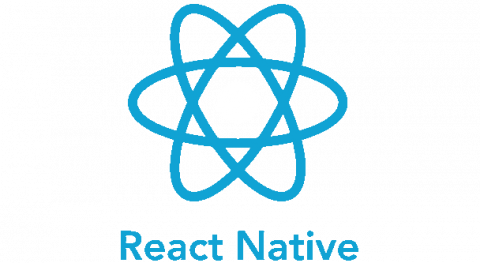

### Connect with me:

Hi, i'm [Kemal BAYINDIR](https://kemalbayindir.com/), a passionate self-taught full stack web & mobile developer and a freelance software engineer from Turkey. My passion for software lies with dreaming up ideas and making them come true with elegant interfaces. I take great care in the experience, architecture, and code quality of the things I build. 

  
- 💼 reach me out via [email](mailto:kemalbayindir@gmail.com)
- 💬 ask me about anything, i am happy to help

**Languages and Tools:**  

 
 

 
 

 

 
 

